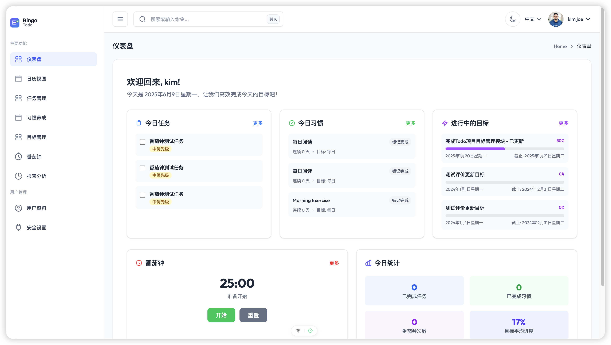

# ToDo 项目管理系统

[English](./README.en.md) | 中文

一个基于 Vue 3 和 Node.js 的现代化 ToDo 项目管理系统，旨在帮助用户高效管理任务、习惯和目标。




## ⚠️ 重要注意事项

### 🚧 开发状态
- **项目状态**: 快速迭代开发中，功能持续完善
- **稳定性**: 部分功能可能存在bug，建议用于学习和参考
- **数据备份**: 建议定期备份重要数据，避免数据丢失
- **版本兼容**: 新版本可能不向后兼容，升级前请备份

### 🔧 技术要求
- **Node.js版本**: 需要 16.0+ 版本，推荐使用 LTS 版本
- **数据库**: 支持 MySQL 8.0+ 或 PostgreSQL 12.0+
- **浏览器**: 推荐使用现代浏览器（Chrome 90+, Firefox 88+, Safari 14+）
- **开发环境**: 建议使用 VS Code 配合相关插件

### 📱 功能限制
- **移动端**: 当前版本主要针对桌面端优化，移动端体验有限
- **多用户**: 暂不支持多用户协作功能
- **离线模式**: 需要网络连接才能正常使用
- **文件大小**: 上传文件建议不超过 10MB

### 🔒 安全提醒
- **密码安全**: 请使用强密码，定期更换
- **数据隐私**: 本地部署时请注意服务器安全配置
- **生产环境**: 生产部署前请修改默认配置和密钥
- **HTTPS**: 生产环境建议启用 HTTPS

### 🐛 已知问题
- **数据同步**: 偶尔可能出现前后端数据不同步
- **文件上传**: 大文件上传可能超时
- **主题切换**: 深色主题下部分组件样式待优化
- **浏览器兼容**: IE 浏览器不支持

### 💡 使用建议
- **首次使用**: 建议先阅读文档，了解基本功能
- **数据导入**: 可通过 API 批量导入现有数据
- **性能优化**: 建议定期清理无用数据和文件
- **问题反馈**: 遇到问题请通过 GitHub Issues 反馈

## 📖 项目概述

本项目是一个功能丰富的个人效率管理工具，集成了任务管理、习惯养成、目标设定、时间管理等多个核心模块。采用前后端分离的架构设计，提供了现代化的用户界面和强大的功能扩展性。

## ✨ 核心功能

### 🎯 任务管理
- 任务创建/编辑与状态管理（待办、进行中、已完成）
- 任务优先级、标签和附件管理
- 支持任务拖拽排序与分类
- 任务依赖关系设置
- 任务时间估算与实际耗时记录
- 批量操作功能（批量编辑、删除、标记完成）

### 🏃‍♂️ 习惯养成
- 习惯创建/编辑与完成记录管理
- 习惯打卡日历视图
- 习惯连续完成统计与奖励机制
- 习惯养成进度可视化
- 习惯分类与标签管理
- 频率设置（每日、每周、自定义）
- 习惯统计和趋势分析
- 打卡提醒功能

### 🎯 目标管理
- 目标分解为子目标与任务
- 目标进度追踪与可视化
- 目标时间线与里程碑设置
- 目标回顾与反思功能
- 目标分类和优先级管理
- 目标与任务关联功能
- 进度自动计算和更新
- 目标统计和完成率分析

### 🍅 番茄钟时间管理
- 经典番茄工作法实现（25分钟工作，5分钟休息）
- 自定义工作和休息时间长度
- 番茄钟与任务集成功能
- 番茄钟统计与可视化报告
- 专注模式（自动禁用通知、全屏模式等）
- 模板管理系统（预设和自定义模板）
- 会话管理（暂停、恢复、取消）
- 生产力评级和心情记录
- 实时统计和历史数据分析

### 👤 用户管理
- 用户注册、登录与信息管理
- 用户资料完善与个性化设置
- 用户头像上传与编辑
- 账号安全设置（密码修改、双因素认证）

### 📊 报表与分析
- 个人生产力分析
- 习惯养成趋势分析
- 目标完成率与偏差分析
- 时间利用效率报表
- 番茄钟专注时间统计
- 任务完成情况分析
- 综合仪表板数据展示
- 自定义报表与数据导出

## 🏗️ 项目架构

```
todo/
├── front/                    # 前端应用 (Vue 3 + TypeScript)
│   ├── src/
│   │   ├── components/       # 组件库
│   │   │   ├── common/       # 通用组件
│   │   │   ├── goals/        # 目标管理组件
│   │   │   ├── habits/       # 习惯管理组件
│   │   │   ├── pomodoro/     # 番茄钟组件
│   │   │   ├── reports/      # 报表组件
│   │   │   └── tasks/        # 任务组件
│   │   ├── views/           # 页面视图
│   │   │   ├── Dashboard.vue # 仪表板
│   │   │   ├── Goals/        # 目标管理页面
│   │   │   ├── Habits/       # 习惯管理页面
│   │   │   ├── Pomodoro/     # 番茄钟页面
│   │   │   ├── Reports/      # 报表页面
│   │   │   └── Tasks/        # 任务管理页面
│   │   ├── services/        # API 服务
│   │   │   ├── goalService.ts
│   │   │   ├── habitService.ts
│   │   │   ├── pomodoroService.ts
│   │   │   ├── reportService.ts
│   │   │   └── taskService.ts
│   │   ├── router/          # 路由配置
│   │   ├── types/           # TypeScript 类型定义
│   │   └── assets/          # 静态资源
│   └── ...
├── backend/                  # 后端服务 (Node.js + Express)
│   ├── api/                 # API 路由层
│   │   ├── goal/            # 目标管理API
│   │   ├── habit/           # 习惯管理API
│   │   ├── pomodoro/        # 番茄钟API
│   │   ├── report/          # 报表API
│   │   └── task/            # 任务管理API
│   ├── biz/                 # 业务逻辑层
│   │   ├── goal/            # 目标业务逻辑
│   │   ├── habit/           # 习惯业务逻辑
│   │   ├── pomodoro/        # 番茄钟业务逻辑
│   │   ├── report/          # 报表业务逻辑
│   │   └── task/            # 任务业务逻辑
│   ├── db/                  # 数据访问层
│   │   ├── goal/            # 目标数据操作
│   │   ├── habit/           # 习惯数据操作
│   │   ├── pomodoro/        # 番茄钟数据操作
│   │   ├── report/          # 报表数据操作
│   │   └── task/            # 任务数据操作
│   ├── dto/                 # 数据传输对象
│   │   ├── goal/            # 目标DTO
│   │   ├── habit/           # 习惯DTO
│   │   ├── pomodoro/        # 番茄钟DTO
│   │   ├── report/          # 报表DTO
│   │   └── todo/            # 任务DTO
│   ├── entity/              # 实体定义
│   │   ├── goal/            # 目标实体
│   │   ├── habit/           # 习惯实体
│   │   ├── pomodoro/        # 番茄钟实体
│   │   └── todo/            # 任务实体
│   └── ...
└── README.md                # 项目文档
```

## 🚀 技术栈

### 前端技术
- **框架**: Vue 3.5+ (Composition API)
- **语言**: TypeScript
- **样式**: Tailwind CSS 4.0+
- **路由**: Vue Router 4.5+
- **状态管理**: Pinia
- **构建工具**: Vite
- **UI组件**: 自研组件库

### 后端技术
- **运行时**: Node.js
- **框架**: Express.js
- **数据库**: MySQL/PostgreSQL
- **API设计**: RESTful API
- **架构模式**: 分层架构 (API-BIZ-DB)

### 开发工具
- **版本控制**: Git
- **包管理**: npm
- **代码规范**: ESLint + Prettier
- **类型检查**: TypeScript

## 📦 快速开始

### ⚠️ 部署前准备

#### 环境检查
```bash
# 检查 Node.js 版本
node --version  # 应该 >= 16.0.0

# 检查 npm 版本
npm --version   # 应该 >= 8.0.0

# 检查数据库连接
mysql --version  # 或 psql --version
```

#### 配置文件设置
```bash
# 后端配置
cp backend/.env.example backend/.env
# 编辑 backend/.env 文件，配置数据库连接等信息

# 前端配置（如需要）
cp front/.env.example front/.env
```

### 环境要求
- Node.js 16.0+
- npm 8.0+
- MySQL 8.0+ 或 PostgreSQL 12.0+

### 安装与运行

1. **克隆项目**
```bash
git clone https://github.com/jeasionr-ui/todo.git
cd todo
```

2. **安装依赖**
```bash
# 安装前端依赖
cd front
npm install

# 安装后端依赖
cd ../backend
npm install
```

3. **配置数据库**
```bash
# 创建数据库（MySQL 示例）
mysql -u root -p -e "CREATE DATABASE todo_db CHARACTER SET utf8mb4 COLLATE utf8mb4_unicode_ci;"

# 导入数据库结构
mysql -u root -p todo_db < backend/init.sql

# 配置数据库连接信息
# 编辑 backend/.env 文件，设置正确的数据库连接参数
```

**⚠️ 数据库配置注意事项：**
- 确保数据库服务已启动
- 数据库用户需要有创建表和插入数据的权限
- 字符集建议使用 utf8mb4 支持 emoji 等特殊字符
- 初次运行会自动创建必要的表结构

4. **启动服务**
```bash
# 启动后端服务 (端口: 3000)
cd backend
npm run dev

# 启动前端开发服务器 (端口: 5173)
cd ../front
npm run dev
```

**⚠️ 启动服务注意事项：**
- 请先启动后端服务，再启动前端服务
- 确保端口 3000 和 5173 没有被其他程序占用
- 首次启动可能需要几分钟时间安装依赖
- 如果启动失败，请检查 Node.js 版本和依赖安装情况

5. **访问应用**
- 前端应用: http://localhost:5173
- 后端API: http://localhost:3000

## 📚 项目文档

- [前端开发文档](./front/README.md) - Vue 3 前端应用开发指南
- [后端开发文档](./backend/README.md) - Node.js 后端服务开发指南
- [API接口文档](./backend/README.md#api-说明) - RESTful API 接口说明

## 🤝 贡献指南

我们欢迎所有形式的贡献，包括但不限于：

- 🐛 Bug 报告
- 💡 新功能建议
- 📝 文档改进
- 🔧 代码贡献

### 提交规范

请遵循以下提交信息格式：
```
type(scope): description

[optional body]

[optional footer]
```

类型说明：
- `feat`: 新功能
- `fix`: Bug 修复
- `docs`: 文档更新
- `style`: 代码格式调整
- `refactor`: 重构
- `test`: 测试相关
- `chore`: 构建配置等

## 📄 许可证

本项目采用非商用许可证。

### 许可证概述

**版权所有 © 2025 Kim**

- ✅ **个人使用**: 允许个人、教育机构、非营利组织等出于非商业目的免费使用
- ✅ **修改分发**: 可以修改和分发，但需保留版权声明和许可证信息
- ✅ **开源要求**: 修改后的版本必须保持开源并标注修改内容
- ❌ **商业使用**: 任何商业用途需要获得单独的商业许可证

### 商业授权

如需商业使用（销售、租赁、提供付费服务、集成到商业产品等），请联系获取商业授权：

- 📧 邮箱: jeasionr@foxmail.com
- 🌐 项目地址: https://github.com/jeasionr-ui/todo

商业授权包含技术支持、定制开发等增值服务。

### 免责声明

本软件按"现状"提供，不提供任何明示或暗示的担保。作者不对因使用本软件而产生的任何损害承担责任。

详细许可证条款请查看 [LICENSE](./LICENSE) 文件。

## 🔧 故障排除

### 常见问题

#### 启动失败
```bash
# 清理依赖重新安装
rm -rf node_modules package-lock.json
npm install

# 检查端口占用
lsof -i :3000  # 检查后端端口
lsof -i :5173  # 检查前端端口
```

#### 数据库连接问题
```bash
# 检查数据库服务状态
# MySQL
sudo systemctl status mysql
# 或 brew services list | grep mysql

# PostgreSQL  
sudo systemctl status postgresql
# 或 brew services list | grep postgresql
```

#### 权限问题
```bash
# macOS/Linux 权限修复
sudo chown -R $(whoami) .
chmod -R 755 .
```

### 🔍 调试模式

开发调试时可以启用详细日志：
```bash
# 后端调试模式
cd backend
DEBUG=* npm run dev

# 前端开发模式已包含热重载和错误提示
cd front
npm run dev
```

### 📞 获取帮助

如果遇到问题，可以通过以下方式获取帮助：

1. **查看日志**: 检查控制台输出的错误信息
2. **搜索文档**: 查看项目 Wiki 和 README 文档
3. **提交 Issue**: 在 GitHub 上创建详细的问题报告
4. **社区讨论**: 参与项目讨论区的交流

**提交 Issue 时请包含：**
- 操作系统和版本
- Node.js 和 npm 版本
- 错误信息和日志
- 重现步骤
- 期望的行为

## 📞 联系我们

- 📧 邮箱: jeasionr@foxmail.com
- 🌐 项目主页: https://github.com/jeasionr-ui/todo
- 📋 问题反馈: https://github.com/jeasionr-ui/todo/issues

## 🗺️ 开发路线图

### 第一阶段 ✅
- [x] 核心功能实现
- [x] 用户管理系统
- [x] 基础任务管理
- [x] 简单报表功能

### 第二阶段 ✅
- [x] 习惯养成系统
- [x] 目标管理功能
- [x] 番茄钟时间管理
- [x] 高级日历功能
- [x] 报表与数据分析

### 第三阶段 📋
- [ ] 社交与协作功能
- [ ] 高级报表与数据分析
- [ ] 移动端应用
- [ ] 性能优化与体验提升

---

⭐ 如果这个项目对你有帮助，请给我们一个 Star！
